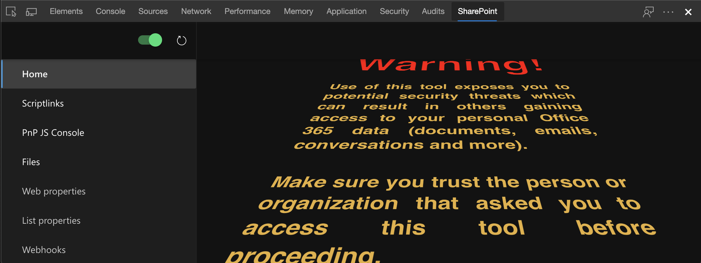
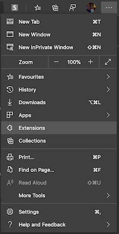
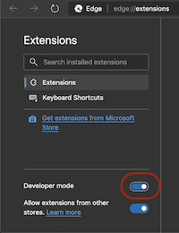
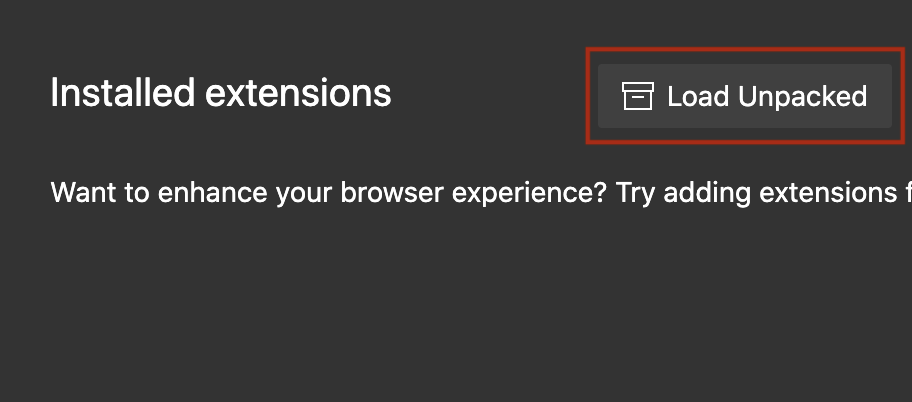
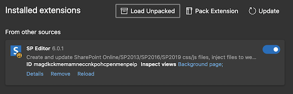
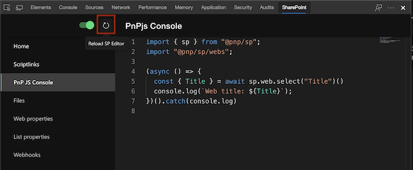

# SP Editor for Microsoft Edge
This is total re-write of SP Editor Extension using React, Office UI Fabric and Ionic. This Extension is installable to Microsoft Edge from [Microsoft Edge Addons](https://microsoftedge.microsoft.com/addons/detail/affnnhcbfmcbbdlcadgkdbfafigmjdkk). Not all features has been ported yet, but I think feature parity will be set during H1. When that happens, Chrome SP Editor will be updated to the same code base.



If you want to chip in by porting features or even creating new ones, here is a quide how to get started contributing.

### running locally with watch mode
```powershell
git clone https://github.com/tavikukko/Chrome-SP-Editor.git # clone the project
git checkout edge-sp-editor # switch to edge branch
npm i # install dependencies
npm run watch # build and start watch mode
code . # open vscode
```
Open Microsoft Edge and select Extensions from the menu



Enable Developer Mode



Load Unpacked Extension, select the **build** folder of the project



If all good, the local build extension will show up



Now you can open a SharePoint site, open devtools and select SharePoint tab. Press the reload button to reload extension after making code changes.


